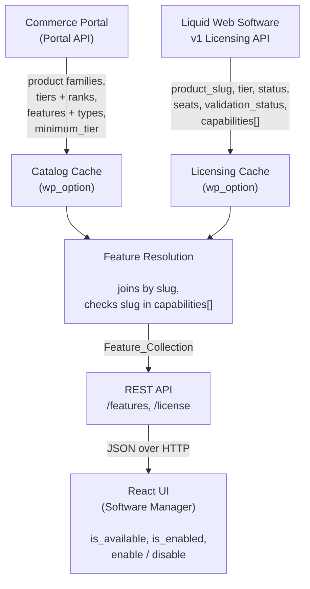

# Harbor

> **Development status.** This system is under active development. The architectural patterns described here (how the layers connect, how resolution works, how strategies operate) are stable. Specific data shapes are not. Tier slugs, tier names, catalog structure, and API response formats are all subject to change as we negotiate the final contracts with the Licensing and Portal teams.
>
> The Liquid Web v1 Licensing API that the current implementation targets is also still in development. If it is not ready or does not meet our needs, we may fall back to the existing StellarWP v3 Licensing API, which is already plugin/theme-aware and provides most of the entitlement data we need.
>
> Fixture data in `tests/_data/` reflects our current best understanding, not a finalized spec.

## What This Is

Harbor is a PHP library that Liquid Web plugins bundle to handle licensing, updates, and feature management. Each Liquid Web plugin ships its own vendor-prefixed copy via Strauss, and there is no shared installation. Multiple copies coexist on a single WordPress site, and the library negotiates internally to avoid conflicts.

Harbor introduces **unified licensing**. Instead of each plugin managing its own license key independently, all Liquid Web products on a site share a single `LWSW-`-prefixed key. That key determines what products are entitled, what tier each is on, and what features are available. The site asks two external services (the Licensing API and the Commerce Portal) and combines their answers to produce a resolved picture of what the customer can use.

## Products and Entry Plugins

A product is a brand family, like Kadence, GiveWP, The Events Calendar, or LearnDash. Each product encompasses many features: plugins and themes that the customer can enable based on their tier.

Each product has an **entry plugin**, a WordPress plugin that bootstraps Harbor on the site. The entry plugin bundles a vendor-prefixed copy of the Harbor library, registers the product with the leader via the product registry, and may contribute an embedded license key. The entry plugin is how a product gets on the site, but it is not the product itself.

Most entry plugins are free and available on WordPress.org. This is deliberate. A customer can install the entry plugin for free, and the unified key unlocks the premium features within that product family.

| Product             | Entry plugins                          | On WordPress.org |
| ------------------- | -------------------------------------- | ---------------- |
| GiveWP              | `give`                                 | Yes              |
| Kadence             | `kadence-blocks`                       | Yes              |
| The Events Calendar | `the-events-calendar`, `event-tickets` | Yes              |
| LearnDash           | `learndash`, `memberdash`              | No               |

All entry plugins share the same unified `LWSW-` key. When an entry plugin activates and detects a unified key on the site, it registers itself with the leader and defers to it. If the entry plugin shipped with an embedded key and the site doesn't have one yet, the embedded key becomes the site's key.

## The Premium-Plugin Gate

Each Harbor instance stays dormant until at least one premium plugin announces itself through the `lw_harbor/premium_plugin_exists` filter. `Harbor::init()` queries the filter via `Premium_Plugin_Registry::any()` and only then registers providers, REST routes, the admin page, and fires the `lw_harbor/loaded` action. This keeps Harbor silent on sites that only have free entry plugins installed.

The filter must be attached before `Harbor::init()` is called. Anywhere earlier in the request works; the simplest pattern is the line right above the `Harbor::init()` call. See the [Integration Guide](guides/integration.md#the-premium-plugin-gate) for the integrator-facing rules.

## The Three Data Layers

Harbor is organized around three data layers. Each answers a different question, and none is sufficient alone.

### Licensing: "What does this key cover?"

The site presents its unified key to the Licensing API. The response is a list of products associated with the key, each with a tier, subscription status, seat counts, and activation state for this domain.

Licensing is the authority on entitlements. It decides whether a key is valid, what tier the customer is on, and whether seats are available. It does not know what features exist within a product. That's the catalog's job.

See [Licensing](subsystems/licensing.md) for the full data shapes, caching, key discovery, and validation workflows.

### Portal: "What does each product offer?"

The Commerce Portal API provides the product catalog, the complete definition of every product family, its tiers, and its features. The catalog is not personalized. Every site sees the same catalog regardless of what key it has.

Each product defines a ranked set of tiers (Basic, Pro, Agency) and a set of features. Each feature has a minimum tier requirement and a delivery type: `plugin` (installable WordPress plugin) or `theme` (installable WordPress theme).

The catalog defines the menu. It does not know what the customer ordered.

See [Portal](subsystems/portal.md) for the product/tier/feature structure, caching, and data shapes.

### Features: "What can this customer actually use?"

Features are not a third data source. They are the computed join of catalog and licensing data. The resolution process walks every feature in the catalog, checks whether the feature's slug appears in the licensing product entry's capabilities array, and produces a resolved collection where each feature knows whether it's available to this customer.

Beyond availability, features track local state, specifically whether a feature is currently enabled on this site. A Plugin feature is enabled by installing and activating the plugin. A Theme feature is enabled by installing the theme. Strategies handle the mechanics of each type. Plugin/Theme features require an active license to enable.

See [Features](subsystems/features.md) for the resolution algorithm, strategies, caching, and the REST API.

### How They Relate

The catalog provides structure (what features exist, their metadata, and which tier they belong to for display). Licensing provides entitlements (what the key covers and, critically, which feature slugs the license grants via the `capabilities` array). Feature resolution checks the capabilities array and produces a collection where each feature knows its availability. Strategies then handle the local mechanics of enabling and disabling.

## Tier Slugs and Capabilities

Both Licensing and the Catalog use the same product-prefixed tier slug convention: `kadence-basic`, `give-pro`, `the-events-calendar-agency`. The catalog uses tier slugs to define minimum requirements per feature (for display and upsell purposes). The licensing response uses the tier slug to describe the customer's subscription level.

Feature availability is **not** determined by comparing tier ranks. Instead, the licensing response includes a `capabilities` array — a list of feature slugs that the license actually grants. A feature is available if and only if its slug appears in this array. The catalog's tier structure is used for display (e.g., showing which tier a feature belongs to in the UI) but has no bearing on the availability decision.

This design allows the licensing service to handle cases that tier rank comparison cannot: promotional grants or individual per-license exceptions. The actual tier slug format, tier names, and number of tiers per product are subject to change as the catalog and licensing contracts are finalized.

## One Key Per Site

A site stores exactly one unified key. All Liquid Web products share it. The key enters the site either embedded in a product's license file or typed into the admin UI by the user. If a key already exists, it takes precedence over newly contributed embedded keys.

The key is the site's identity to the licensing system. Without a key, the site is unlicensed and no API calls are made.

See [Unified License Key: System Design](architecture/unified-license-key-system-design.md) for key change scenarios, seat mechanics, and system boundaries.

## Multi-Instance Architecture

Because each entry plugin bundles its own vendor-prefixed copy of Harbor, a site with multiple Liquid Web products has many Harbor instances loaded simultaneously. The instances negotiate leadership (the highest version wins), and the leader takes ownership of all unified licensing concerns: key storage, API communication, feature resolution, REST routes, and the admin page.

Non-leader instances (thin instances) declare themselves to the leader through the product registry and defer to it for everything else. They do not validate keys, talk to APIs, or render licensing UI.

See [Multi-Instance Architecture](architecture/fat-leader-thin-instance.md) for leader election, cross-instance communication, and the product registry.

## The Admin Page

The leader renders the Software Manager, a React-based admin page for managing all Liquid Web products on the site. It shows the unified key status, licensed products with their tiers, and features that can be toggled on and off. The frontend communicates with the backend through REST endpoints served by the leader instance.

## Caching

The data layers use different caching strategies:

| Cache             | Type      | TTL             | Key / Location                 | Invalidation                    |
| ----------------- | --------- | --------------- | ------------------------------ | ------------------------------- |
| Licensed products | Option    | None (persist)  | `lw_harbor_licensing_products` | `License_Repository::refresh()` |
| Portal catalog    | Option    | None (persist)  | `lw_harbor_catalog_state`      | `Catalog_Repository::refresh()` |
| Resolved features | In-memory | Current request | —                              | `Feature_Repository::refresh()` |

The unified key itself is stored in a WordPress option (`lw_harbor_unified_license_key`), not a transient.

## Legacy Compatibility

Harbor does not replace per-resource licensing for products that haven't adopted unified keys. Products using StellarWP v2/v3 per-resource keys continue through their existing path unchanged. The leader displays legacy key information in the admin UI but does not validate legacy keys. Validation stays in the per-resource path.

There is no automatic migration from per-resource keys to unified keys.

## Documentation Map

| Document                                                                 | Covers                                                             |
| ------------------------------------------------------------------------ | ------------------------------------------------------------------ |
| [This document](harbor.md)                                               | Architecture overview and how the layers relate                    |
| [Licensing](subsystems/licensing.md)                                     | Key discovery, API responses, validation workflows, caching        |
| [Portal](subsystems/portal.md)                                           | Product families, tiers, features, the Commerce Portal API         |
| [Features](subsystems/features.md)                                       | Feature types, resolution, strategies, Manager API, data shapes    |
| [Cron](subsystems/cron.md)                                               | Periodic refresh schedule, cleanup on deactivation                 |
| [Unified License Key](architecture/unified-license-key-system-design.md) | Key model, seat mechanics, system boundaries                       |
| [Multi-Instance Architecture](architecture/fat-leader-thin-instance.md)  | Leader election, cross-instance hooks, thin instances              |
| [Naming Conventions](architecture/conventions.md)                        | Prefixes, separators, and identifier patterns across all scopes    |
| [REST API Reference](api/rest/)                                          | Endpoint specs, parameters, error codes                            |
| [WP-CLI Reference](guides/cli.md)                                        | Command reference and scripting patterns                           |
| [Integration Guide](guides/integration.md)                               | Bootstrapping Harbor in a plugin, legacy license reporting         |
| [Frontend](subsystems/frontend.md)                                       | React app, @wordpress/data store, component hierarchy, CSS scoping |
| [Notices](subsystems/notices.md)                                         | Admin notices, legacy license warnings, persistent dismissal       |
| [Testing Guide](guides/testing.md)                                       | Codeception setup, fixture data, debug logging                     |
