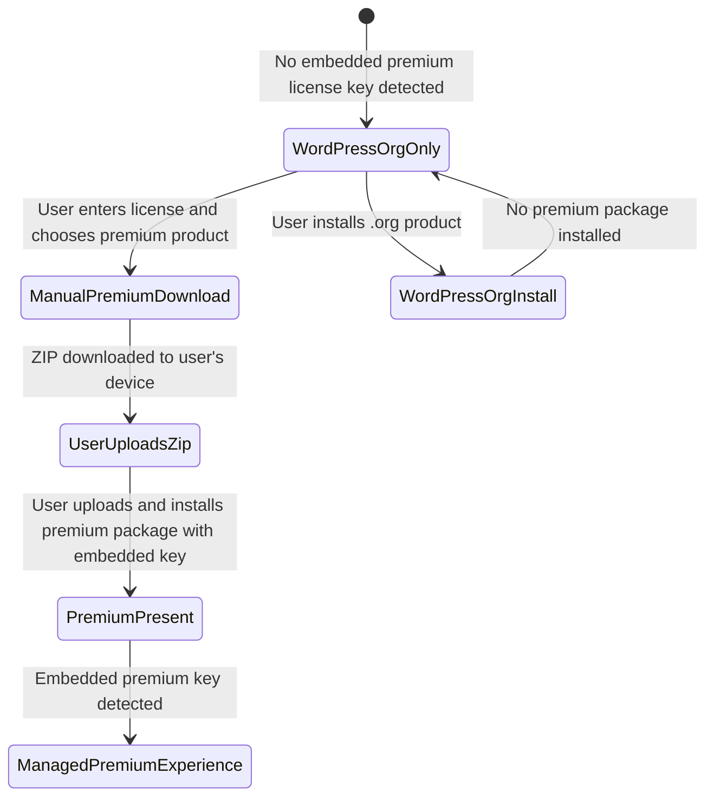

# Harbor Product Download System

## Purpose

Harbor needs to provide a compliant product download experience for Liquid Web software products from within WordPress. The system should help customers discover products they are entitled to, understand what is available to install, and obtain premium product files without turning WordPress.org-distributed plugins into a mechanism for delivering executable code from third-party systems.

This document describes the system Harbor needs to support and the requirements that govern it. It intentionally focuses on the desired product behavior rather than the current implementation.

## Compliance driver

WordPress.org guideline #8 states: [Plugins may not send executable code via third-party systems](https://developer.wordpress.org/plugins/wordpress-org/detailed-plugin-guidelines/#8-plugins-may-not-send-executable-code-via-third-party-systems).

For Harbor, the practical requirement is:

> When Harbor is available only because a WordPress.org-distributed plugin is installed, Harbor must not cause WordPress to fetch, install, update, or activate executable plugin or theme code from Liquid Web or any other non-WordPress.org system.

This restriction applies to premium products and any other executable packages that are not distributed through WordPress.org.

## Product goal

Harbor should make it easy for a customer to move from a free product experience to a paid product experience while respecting the boundary between WordPress.org-distributed code and externally distributed premium code.

The desired experience is:

1. A customer installs one of our free products from WordPress.org.
2. Harbor helps the customer identify related premium products or licensed entitlements.
3. If the customer is entitled to a premium product, Harbor provides a safe way to obtain that product package.
4. The customer explicitly downloads the premium package to their own device.
5. The customer explicitly uploads and installs that package into WordPress using a user-driven upload flow.
6. Once premium product code is present on the site, premium product management can use the capabilities provided by that premium code.

## Operating contexts

Harbor must distinguish between two product contexts. The context should be determined by the presence of an embedded license key in an installed Liquid Web premium package, not by the license key the user manually enters into Harbor.

A manually entered license key proves the customer has entitlement, but it does not by itself prove that externally distributed product code is already present on the site. An embedded license key does. WordPress.org-distributed products should never contain an embedded Liquid Web premium license key, while premium packages delivered by Liquid Web systems are expected to include one.

### WordPress.org-only context

A site is in the WordPress.org-only context when Harbor does not detect an embedded license key in any installed Liquid Web premium package. In this context, the site may still have a manually entered license key, but it has not yet proven that a premium package delivered by Liquid Web systems is installed.

In this context, Harbor is operating under the constraints of WordPress.org-distributed code. It may present information and guide the user, but it must not directly deliver non-WordPress.org executable code into the WordPress filesystem.

### Premium-present context

A site is in the premium-present context when Harbor detects an embedded license key in an installed Liquid Web premium package. The embedded key is used only as a contextual signal that premium code delivered by Liquid Web systems is already present. It is separate from the active license key the customer may enter, change, or remove in the Harbor interface.

In this context, the site already contains product code distributed outside WordPress.org. Premium product management may rely on the behavior and update mechanisms provided by that premium code, subject to the product’s own licensing and consent requirements.

## Required behavior

### Product discovery

Harbor should be able to show relevant Liquid Web products, including:

- Products available from WordPress.org.
- Premium products associated with a customer’s license or account.
- Installed products and their current status.
- Products that require manual download/upload before installation.

Product discovery must not imply that all products can be installed the same way. The interface should clearly distinguish WordPress.org installs from premium package downloads.

### License-aware product availability

Harbor may use a license or account connection to determine which premium products a customer is entitled to access.

After a license is entered, Harbor may show entitled premium products. However, in the WordPress.org-only context, license entitlement must not unlock direct server-side installation of premium executable code.

### WordPress.org product installation

Products distributed through WordPress.org may use normal WordPress.org installation and activation flows.

Harbor may allow a user to install or activate WordPress.org-hosted products through WordPress APIs because those packages are delivered by WordPress.org, not by Liquid Web’s external product delivery system.

### Premium product download in WordPress.org-only context

For premium or non-WordPress.org products, Harbor must use a user-mediated download flow.

Requirements:

- The call to action should communicate that the user is downloading a package, not directly installing it.
- The premium ZIP must be downloaded to the user’s device through the browser.
- WordPress must not fetch the premium ZIP directly from Liquid Web servers in this context.
- Harbor must not automatically install, update, or activate the premium package after license entry.
- Harbor should explain the next step: upload the downloaded ZIP into WordPress.
- Harbor may provide an upload interface, provided the user explicitly selects or provides the downloaded ZIP for upload.

Recommended language examples:

- “Download ZIP”
- “Download premium plugin”
- “Download this product, then upload it to WordPress to install.”

Avoid language such as:

- “Install”
- “Install and activate”
- “Activate premium product”

unless the action is limited to WordPress.org-hosted code or the site is already in the premium-present context.

### Premium product management in premium-present context

When a premium/non-WordPress.org Liquid Web product is already installed, Harbor may provide a fuller product management experience for premium products.

This can include direct product updates, installs, or activations where those behaviors are provided by or authorized through the premium product ecosystem rather than solely through WordPress.org-distributed code.

The interface should still be explicit about what action is occurring and should preserve any required licensing, authentication, or consent flows.

### Hiding or disabling the Harbor products page

When Harbor detects the premium-present context, the system should not require the WordPress.org external communication consent screen for the premium management experience. The consent and revoke-access flow is intended for WordPress.org-only contexts where externally hosted catalog and licensing communication needs explicit disclosure.

The system should provide a way for site owners or developers to hide or disable the Harbor product management page.

This gives customers control over whether the product discovery surface appears in their WordPress admin and helps address concerns from users who do not want a bundled product management interface.

## Non-goals

The system should not attempt to argue around or test the limits of WordPress.org guideline #8.

The system should not depend on the claim that Liquid Web is a trusted source for direct executable delivery when Harbor is running only from WordPress.org-distributed code.

The system should not make license entry equivalent to permission for direct server-side installation of premium code in a WordPress.org-only context.

The system should not use a manually entered license key as the signal that premium code is already installed. Premium-present context should come from detecting an embedded license key in an installed premium package.

## Success criteria

The system is successful when:

- A free WordPress.org plugin can include Harbor without directly delivering premium executable code from Liquid Web servers into WordPress.
- Customers with valid licenses can still obtain their premium products from within the guided Harbor experience.
- The user clearly understands when they are downloading a ZIP versus installing a product.
- WordPress.org-hosted products continue to support normal install and activation flows.
- Premium product management remains efficient once premium code is already present on the site.
- Premium-present behavior is enabled by detecting an embedded license key in an installed premium package, not merely by detecting a manually entered license key.
- Developers and site owners have a documented way to hide or disable the Harbor product page.

## State model

## Core principle

Harbor should guide customers to the right product, but the source and method of executable code delivery must match the site’s context.

In a WordPress.org-only context, Harbor is a guide and download facilitator for premium products, not a direct installer of external executable code.
