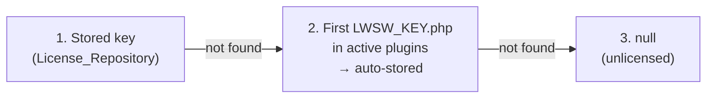
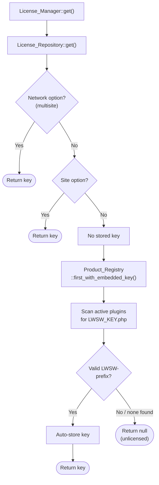
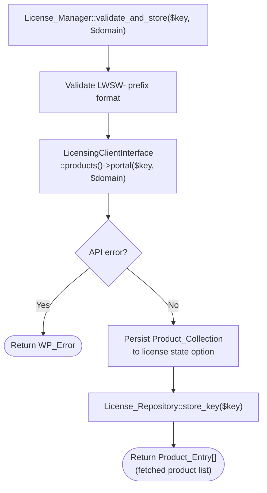
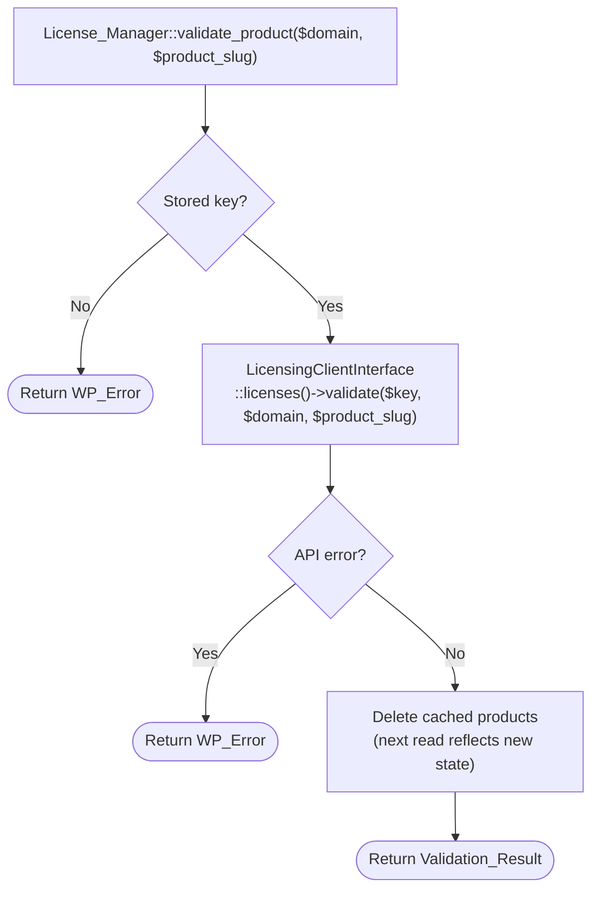
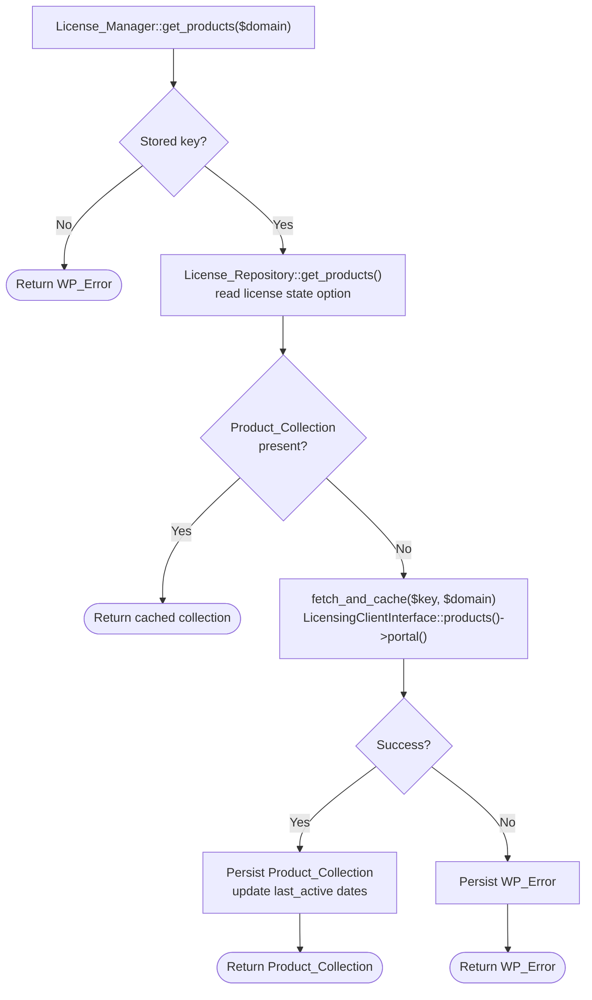

# Licensing

## Summary

The Licensing subsystem is how a WordPress site learns what a unified license key covers. The site presents its `LWSW-`-prefixed key to the Licensing API, and the API returns which products are entitled, what tier each is on, and whether seats are available. The site stores this response and uses it as the source of truth for all entitlement decisions.

This document describes the data the site gets from Licensing, how it stores that data, and the workflows that drive key discovery and validation.

> **Development status.** The architectural patterns here (key discovery, caching, repository structure) are stable. The upstream API is not. The current implementation targets a Liquid Web v1 Licensing API that is still in development. If it does not ship in time or does not meet our needs, we may fall back to the existing StellarWP v3 Licensing API. The StellarWP v3 API is already plugin/theme-aware and gives us most of the entitlement data we need, though it lacks some portal-style information like upsell data. Specific data shapes, tier slugs, and response formats are all subject to change. Fixture data in `tests/_data/licensing/` reflects our current working assumptions, not a finalized spec.

## The Unified Key

A site has one unified license key. It reaches the site in one of two ways:

- **Embedded**: a product purchased from the Liquid Web store ships with a license file containing the key
- **User-entered**: the user types the key into the admin UI

The `License_Manager` resolves the key using a priority system: a stored key always wins. If no key is stored, it scans active plugins for a bundled `LWSW_KEY.php` file. If one is found, the key it returns is auto-stored so future lookups skip the discovery step.



Keys are validated for format before storage. Only keys matching the `LWSW-` prefix are accepted. `validate_and_store()` goes further: it presents the key to the Licensing API first, and only persists it if the API recognizes it. This prevents invalid keys from entering storage.

### Multisite

On multisite, key storage is network-aware. The `License_Repository` checks the network option first, then falls back to the site option. Storage can target either level explicitly via the `$network` parameter on `store()` and `delete()`.

## What Licensing Returns

### Product Entries

When the site calls `get_products()` with its key, Licensing returns an array of product entries, one per product associated with the key. Each entry contains:

| Field               | Type         | Description                                                                                  |
| ------------------- | ------------ | -------------------------------------------------------------------------------------------- |
| `product_slug`      | string       | Product identifier (e.g., `give`, `kadence`)                                                 |
| `tier`              | string       | Current subscription tier, product-prefixed (e.g., `give-pro`, `kadence-agency`)             |
| `pending_tier`      | string\|null | Scheduled tier change on next renewal, if any                                                |
| `status`            | string       | Subscription status: `active`, `expired`, `suspended`, `cancelled`                           |
| `expires`           | string       | Expiration date (`Y-m-d H:i:s`)                                                              |
| `site_limit`        | int          | Maximum site activations. `0` means unlimited                                                |
| `active_count`      | int          | Current number of activated sites                                                            |
| `installed_here`    | bool\|null   | Whether this product is activated on the requesting domain. `null` if no domain was provided |
| `validation_status` | string\|null | One of the `Validation_Status` constants                                                     |
| `capabilities`      | string[]     | Feature slugs this license grants access to. This is the source of truth for `is_available`  |

`get_products()` is a **read-only** operation. It does not consume seats. It is the bulk fetch used for periodic status checks.

### Validation Results

When the site calls `validate()` for a single product, Licensing returns a more detailed response with three sections:

**License** (the key itself):

```json
{
  "key": "LWSW-...",
  "status": "active"
}
```

**Subscription** (the product's subscription under this key):

```json
{
  "product_slug": "give",
  "tier": "give-pro",
  "site_limit": 3,
  "expiration_date": "2026-12-31 23:59:59",
  "status": "active"
}
```

**Activation** (whether the product is activated on this domain, only present if activated):

```json
{
  "domain": "example.com",
  "activated_at": "2024-03-04 12:34:56"
}
```

`validate()` **may consume a seat** as a side effect if this is the product's first activation on the domain. If the product is already active on the domain, no seat is consumed.

### Validation Statuses

The `Validation_Status` enum covers every state a product can be in:

| Status               | Meaning                                               |
| -------------------- | ----------------------------------------------------- |
| `valid`              | Key is valid, product activated on this domain        |
| `expired`            | Subscription has expired                              |
| `suspended`          | Subscription is suspended                             |
| `cancelled`          | Subscription is cancelled                             |
| `license_suspended`  | Entire license is suspended (affects all products)    |
| `license_banned`     | Entire license is banned (affects all products)       |
| `no_subscription`    | No subscription exists for this product under the key |
| `not_activated`      | Product is not activated on this domain               |
| `out_of_activations` | All seats are consumed                                |
| `invalid_key`        | Key is not recognized                                 |

## Storage

### Key Storage

The unified key is stored in a WordPress option (`lw_harbor_unified_license_key`). The `License_Repository` handles reads and writes, including multisite-aware lookups.

### License State Storage

The full product portal and related metadata are stored in a WordPress option (`lw_harbor_licensing_products_state`) as a state envelope with four keys:

| Key               | Type                 | Description                                                                                 |
| ----------------- | -------------------- | ------------------------------------------------------------------------------------------- |
| `collection`      | `array&#124;null`    | `Product_Collection::to_array()` from the last successful fetch, or `null` if never fetched |
| `last_success_at` | `int&#124;null`      | Unix timestamp of the last successful fetch                                                 |
| `last_failure_at` | `int&#124;null`      | Unix timestamp of the most recent failed fetch, or `null` if no failure has occurred        |
| `last_error`      | `WP_Error&#124;null` | Error from the most recent failed attempt, or `null` if the last fetch succeeded            |

Unlike a transient, this option has no TTL — product data persists indefinitely. Re-validation frequency (how often the API is called to refresh) is a separate concern from data persistence.

On a successful fetch, `collection` and `last_success_at` are updated and `last_error` is cleared. `last_failure_at` is not touched so callers can always see when the last failure occurred. On a failed fetch, `last_error` and `last_failure_at` are updated; the existing `collection` and `last_success_at` are preserved so the last known-good portal remains available even when the licensing server is unreachable.

Since there is only one unified key per site, there is only one state entry. Invalidation is simple: `delete_products()` removes the option entirely, causing the next read to return `null` and trigger a fresh API call.

## Product Registry

Products opt into unified licensing by bundling an `LWSW_KEY.php` file in their plugin root directory. The file must return a single `LWSW-`-prefixed key string:

```php
<?php return 'LWSW-xxxx-xxxx-xxxx-xxxx';
```

The presence of this file is the signal that a product belongs to the Harbor unified licensing system. Products managed by Uplink v2 do not ship this file; Harbor only concerns itself with products that do.

`Product_Registry` scans active WordPress plugins for this file at key-discovery time. No filter registration is required from the product side.

## API Client

Harbor uses `stellarwp/licensing-api-client-wordpress` for all communication with the Liquid Web v1 licensing API. `License_Manager` depends on `LicensingClientInterface` from the package and calls `$client->products()->portal($key, $domain)` to fetch the product portal. The package handles HTTP transport (via WordPress's HTTP API), request building, response parsing, and error handling.

`Licensing\Provider` wires the client using `WordPressApiFactory` with the base URL from `Config::get_licensing_base_url()`.

The `Clients\Fixture_Client` implements `LicensingClientInterface` for use in tests. It reads JSON fixture files from `tests/_data/licensing/`, mapping key values to filenames (e.g., `LWSW-unified-pro-2026` reads from `lwsw-unified-pro-2026.json`), and returns `Portal` objects. Unrecognized keys throw `NotFoundException`.

`Product_Entry` remains Harbor's own DTO. It is hydrated from the package's `PortalEntry` type via `Product_Entry::from_portal_entry()`.

The fixture set covers the common scenarios:

| Fixture                    | Scenario                                                  |
| -------------------------- | --------------------------------------------------------- |
| `lwsw-unified-basic-2026`  | Basic tier (e.g., `give-basic`), 1 site limit per product |
| `lwsw-unified-pro-2026`    | Pro tier (e.g., `give-pro`), 3 site limits                |
| `lwsw-unified-agency-2026` | Agency tier (e.g., `give-agency`), unlimited sites        |
| `lwsw-unified-pro-expired` | All products expired                                      |
| `lwsw-unified-pro-mixed`   | Mixed statuses across products                            |

## Error Codes

All errors use `WP_Error` with these codes:

| Code                          | Constant            | Meaning                                            |
| ----------------------------- | ------------------- | -------------------------------------------------- |
| `lw-harbor-invalid-key`       | `INVALID_KEY`       | Key not recognized by the API                      |
| `lw-harbor-invalid-response`  | `INVALID_RESPONSE`  | API response couldn't be decoded                   |
| `lw-harbor-product-not-found` | `PRODUCT_NOT_FOUND` | Product slug not found in the portal for this key |
| `lw-harbor-store-failed`      | `STORE_FAILED`      | Key couldn't be persisted to the database          |

## HTTP Infrastructure

Both the Licensing and Portal subsystems use `WordPressHttpClient` from `stellarwp/licensing-api-client-wordpress` as their HTTP transport. This wraps WordPress's `wp_remote_request()` and implements the PSR-18 interface, so no Symfony dependency is required.

The base URL for licensing API requests comes from `Config::get_licensing_base_url()`, which defaults to `https://licensing.stellarwp.com`. It can be overridden via `Config::set_licensing_base_url()`. The portal uses `Config::get_portal_base_url()` separately.

## Workflows

### Key Discovery



### Key Validation and Storage



### Product Validation

Validation is separate from key storage. Storing a key verifies it and fetches its products, but does not consume any seats. Validation explicitly requests a seat for a specific product on this domain.



### Periodic Status Check



## REST API

See [REST: License](../api/rest/license.md) for the endpoint reference.

## Relationship to Portal and Features

Licensing answers "what does this key cover?" but not "what can the customer do with it?" That second question requires the [Portal](portal.md) and the [Features](features.md) layer.

### Tier Slugs

Both Licensing and the Portal use the same product-prefixed tier slug convention (e.g., `give-pro`, `kadence-agency`). This means tier values from a licensing response can be looked up directly in the portal's tier collection without transformation.

### How Licensing Data Feeds Feature Resolution

The `Resolve_Feature_Collection` class consumes the `Product_Collection` from the licensing `License_Repository` alongside the `Portal_Collection` from the portal `Portal_Repository`. For each product in the portal, it looks up the matching licensing entry to determine `is_available` for each feature:

- **If a product entry exists**: a feature is available if its slug appears in the entry's `capabilities` array. This is the source of truth for access — it handles promotional grants and individual exceptions that the portal's tier structure alone cannot express.
- **If no product entry exists** (unlicensed): the resolver falls back to the portal's tier rank structure, making only free-tier features (minimum tier rank 0) available.

### Cache Invalidation

When the license key changes, the feature resolution cache auto-invalidates. This handles license key changes without manual cache purging.

## What Licensing Does Not Do

- **Release seats**: seats can only be freed through Portal by an authenticated user. This prevents abuse.
- **Assign tiers**: tiers come from the API response, not from product declarations.
- **Validate legacy keys**: per-resource StellarWP v2/v3 keys continue through their existing path unchanged.
- **Support multiple keys per site**: one key, one source of truth.
