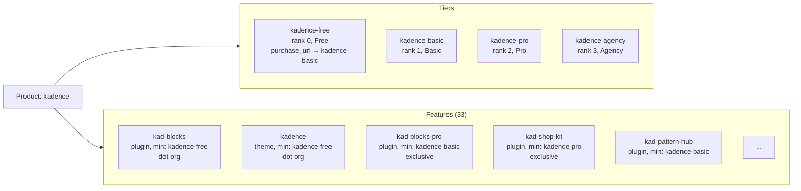

# Portal

## Summary

The Portal subsystem is how a WordPress site learns the full shape of a product family: what tiers exist, what features are available at each tier, and how to acquire or install those features. Where Licensing tells the site "what does this key cover?", the Portal tells the site "what does this product offer?"

The portal data comes from the Commerce Portal API. It is not license-specific. It describes the complete product portal regardless of what a particular key is entitled to. The intersection of portal data and licensing data is what determines what a site can actually use.

> **Development status.** The portal structure described here represents the data we have identified that we need, not a finalized contract. The actual field names, tier slugs, tier names, and response shape are still being negotiated with the Portal team. Fixture data in `tests/_data/portal.json` is a working prototype, not a spec.

## What the Portal Contains

### Products

The portal is organized by product. Kadence, GiveWP, LearnDash, and The Events Calendar are each a product. A product encompasses many features (plugins and themes) that customers can enable based on their tier.

Each product has an entry plugin that bootstraps Harbor on the site (see [Products and Entry Plugins](../harbor.md#products-and-entry-plugins)), but the product itself is the umbrella under which all of its features, tiers, and licensing live. A product portal contains two things: tiers and features.

The product's own entry plugin is also returned as a feature within its portal. For example, the `kadence` product includes a `kadence` feature of type `theme` representing Kadence itself. This means the update and feature management pipelines treat the product the same as any other feature — there is no special case for "the product itself" versus "add-on features."

### Tiers

Each product defines an ordered set of tiers that represent subscription levels. Tiers are ranked, and a higher rank means a higher tier with more entitlements.

| Field          | Type     | Description                                                                 |
| -------------- | -------- | --------------------------------------------------------------------------- |
| `slug`         | string   | Unique identifier within the product (e.g., `kadence-basic`, `kadence-pro`) |
| `name`         | string   | Display name (e.g., "Basic", "Pro", "Agency")                               |
| `rank`         | int      | Numeric ordering value. Higher rank = higher tier                           |
| `price`        | int      | Price in the smallest currency unit (e.g., cents)                           |
| `currency`     | string   | Currency code (e.g., `USD`)                                                 |
| `features`     | string[] | Marketing feature strings for this tier                                     |
| `herald_slugs` | string[] | Herald slugs associated with this tier                                      |
| `purchase_url` | string   | Checkout URL to purchase or upgrade to this tier                            |

Tiers are always sorted by rank. This ordering drives feature availability. A feature that requires `kadence-pro` (rank 2) is available to anyone on `kadence-pro` or `kadence-agency` (rank 3), but not to someone on `kadence-basic` (rank 1).

Products that have free offerings include a free tier at rank 0 (e.g., `kadence-free`). The free tier is the entry point to the tier hierarchy. Features gated at the free tier are available without a license key — an unlicensed user resolves to rank 0, and `0 >= 0` satisfies the availability check. The `purchase_url` on the free tier points to the first paid tier, providing the upgrade path.

A product's tiers are its own. Tier slugs are namespaced to the product (`kadence-basic`, `give-basic`) so there's no collision across product families.

### Features

Features are the individual plugins and themes that make up a product family. Each feature belongs to one product and has a minimum tier requirement.

| Field               | Type           | Description                                                                                                   |
| ------------------- | -------------- | ------------------------------------------------------------------------------------------------------------- |
| `slug`              | string         | Unique identifier (e.g., `kad-blocks-pro`, `ld-propanel`)                                                     |
| `kind`              | string         | One of `plugin` or `theme`                                                                                    |
| `minimum_tier`      | string         | Tier slug required to access this feature                                                                     |
| `plugin_file`       | string\|null   | Plugin file path relative to plugins dir (e.g., `kadence-blocks-pro/kadence-blocks-pro.php`). Null for themes |
| `wporg_slug`        | string\|null   | WordPress.org slug for `plugins_api()`. Non-null means the feature is on WordPress.org                        |
| `download_url`      | string\|null   | Download URL for features not on WordPress.org                                                                |
| `version`           | string\|null   | Latest available version from the Commerce Portal                                                             |
| `release_date`      | string\|null   | Release date of the latest version (ISO 8601)                                                                 |
| `changelog`         | string\|null   | Changelog HTML for the latest version, consistent with `plugins_api()` sections                               |
| `name`              | string         | Display name                                                                                                  |
| `description`       | string         | Short description of what the feature does                                                                    |
| `category`          | string         | Grouping category (e.g., `blocks`, `theme`, `security`, `woocommerce`)                                        |
| `authors`           | string[]\|null | Product/author names. Null if not applicable.                                                                 |
| `documentation_url` | string         | Link to the feature's documentation                                                                           |
| `homepage`          | string\|null   | URL to the feature's homepage                                                                                 |

#### Feature Types

Features come in two types, each representing a different kind of deliverable:

**`plugin`**: an installable WordPress plugin. Has a `plugin_file` (plugin file path) and either a `download_url` (for exclusive features) or is available on WordPress.org (`wporg_slug` is non-null). These are features that need to be downloaded, installed, and activated.

**`theme`**: an installable WordPress theme. The `slug` doubles as the theme stylesheet (directory name). Has either a `download_url` (for exclusive features) or is available on WordPress.org (`wporg_slug` is non-null).

#### Tier Gating

Every feature declares a `minimum_tier`. This is the lowest tier slug at which the feature becomes available. Because tiers are ranked, a feature available at `kadence-pro` (rank 2) is also available at `kadence-agency` (rank 3).

The portal defines what tier a feature requires. Licensing defines what tier the customer is on. The intersection determines availability.

## Caching and Data Access

### Portal Repository

The `Portal_Repository` wraps the portal client with transient caching. The cache uses a 12-hour TTL (`lw_harbor_portal`), the same duration as the licensing cache.

```
Portal_Repository::get()
├─ check transient cache
├─ if hit → return cached Portal_Collection
├─ if miss → Portal_Client::get_portal()
├─ cache result (success or error, 12hr TTL)
└─ return Portal_Collection|WP_Error
```

`refresh()` explicitly clears the cache and re-fetches. This is used when stale data needs to be invalidated immediately.

Both successful responses and errors are cached. An API error is stored for the full TTL to avoid hammering the API on repeated failures.

### Collections

The portal uses two typed collection classes:

**`Portal_Collection`** holds `Product_Portal` objects, keyed by product slug. This is what the repository returns. Lookups are by slug: `$collection->get('kadence')` returns the Kadence product portal or `null`.

**`Tier_Collection`** holds `Portal_Tier` objects within a product, keyed by tier slug. Tiers are automatically sorted by rank on construction.

Both collections prevent duplicate keys. Adding an item with an existing key returns the existing item without overwriting.

## API Client

The `Portal_Client` contract defines a single operation:

- **`get_portal(): Portal_Collection|WP_Error`**: fetch the full product portal.

Unlike the licensing client, this is not parameterized by key or domain. The portal describes the full product universe. It is the same regardless of who is asking.

The production implementation is `Clients\Http_Client`, which uses the same PSR-18 HTTP infrastructure as the licensing client (see [Licensing: HTTP Infrastructure](licensing.md#http-infrastructure)). The base URL comes from `Config::get_portal_base_url()`.
During development, the `Clients\Fixture_Client` is wired in. It reads a single JSON fixture file (`tests/_data/portal.json`) containing all products.
Tests use a fixture PSR-18 client that serves local JSON from `tests/_data/portal/`.

## Error Codes

| Code                                 | Constant            | Meaning                                  |
| ------------------------------------ | ------------------- | ---------------------------------------- |
| `lw-harbor-portal-product-not-found` | `PRODUCT_NOT_FOUND` | Requested product slug not in the portal |
| `lw-harbor-portal-invalid-response`  | `INVALID_RESPONSE`  | API response couldn't be parsed          |

## Portal Shape

The fixture data illustrates the structure. Each product in the current portal follows a common pattern:



Note that `kadence` appears as both the product and as a feature within it. This is intentional — the product's entry point flows through the same update and feature management pipelines as any other feature.

The current fixture covers four product families:

| Product               | Tiers                        | Features | Categories                                                                                    |
| --------------------- | ---------------------------- | -------- | --------------------------------------------------------------------------------------------- |
| `kadence`             | 4 (Free, Basic, Pro, Agency) | 33       | theme, blocks, design, woocommerce, forms, social, content, security, management, performance |
| `learndash`           | 3 (Basic, Pro, Agency)       | 8        | core, membership, reporting, import, community                                                |
| `give`                | 4 (Free, Basic, Pro, Agency) | 28       | core, forms, gateway, email, reporting, marketing, integration                                |
| `the-events-calendar` | 4 (Free, Basic, Pro, Agency) | 9        | core, ticketing, community, integration                                                       |

## Relationship to Licensing and Features

### What the Portal Provides to Feature Resolution

The portal is one of two inputs to the [Features](features.md) layer. It contributes:

1. **The feature definitions**, meaning every feature that exists within a product, with its type, minimum tier, installation metadata, and display information.
2. **The tier hierarchy**, the ranked set of tiers that determines which features a given tier unlocks. The `Resolve_Feature_Collection` class looks up each feature's `minimum_tier` in the product's tier collection to get its rank, then compares against the customer's tier rank from [Licensing](licensing.md).

### Tier Slugs

Tier slugs are product-prefixed (`kadence-pro`, `give-basic`) and are consistent between the portal and licensing responses. This means a tier value from a licensing `Product_Entry` can be looked up directly in the portal's `Tier_Collection` without transformation.

### Feature Type Mapping

The portal uses delivery-oriented kind names (`plugin`, `theme`). The Features subsystem maps these to its own type hierarchy during resolution:

| Portal kind | Feature class | Meaning                      |
| ----------- | ------------- | ---------------------------- |
| `plugin`    | `Plugin`      | Installable WordPress plugin |
| `theme`     | `Theme`       | Installable WordPress theme  |

### What the Portal Does Not Know

The portal describes what exists. It does not know:

| Question                                     | Answer comes from                                         |
| -------------------------------------------- | --------------------------------------------------------- |
| What tier is the customer on?                | [Licensing](licensing.md)                                 |
| Is this key valid?                           | [Licensing](licensing.md)                                 |
| Is a feature available to this customer?     | [Features](features.md) (joins portal + licensing)        |
| Is a feature currently enabled on this site? | [Features](features.md) (checks local state)              |
| What version is installed on this site?      | [Features](features.md) (reads from disk via Installable) |

The portal is the menu. Licensing is the receipt. Feature resolution is the waiter who checks both before serving.

## What the Portal Does Not Do

- **Know about license keys**: the portal is not parameterized by key. It describes what exists, not what a customer owns.
- **Track activation state**: whether a feature is installed or active on a site is not a portal concern.
- **Change based on customer**: every site sees the same portal. Personalization happens by combining portal data with licensing data.
